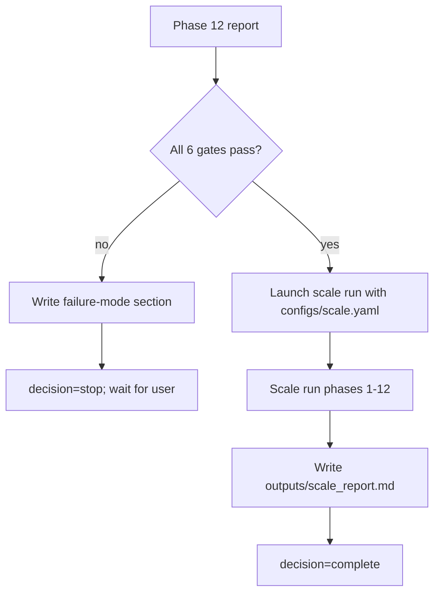

# Multi-Hop RAG Dataset Construction -- Autonomous Executor Spec

You are a Claude Code agent executing the multi-hop RAG dataset pipeline described in `pipeline_description` (local, gitignored, canonical spec). This file (`CLAUDE.md`) tells you exactly how to do that: which env, which models, which files to write, which jobs to launch, what to monitor, when to stop. **Run autonomously. Do not stop except on (a) completion, (b) fatal unrecoverable error, or (c) explicit user interrupt.**

---

## 1. Mission

Build a high-quality multi-hop RAG dataset in two phases:

1. **Pilot** -- target ~1000 validated multi-hop questions from the HotpotQA Wikipedia corpus. Exercises every stage of the pipeline end-to-end at small scale.
2. **Auto-escalate** -- iff the pilot passes all quality gates (Section 11), run the same pipeline at ~5000 Q scale (`configs/scale.yaml`). Otherwise stop and write a failure report.

**Pilot success criteria table:**

| Gate | Threshold | Source |
|---|---|---|
| multihop_rate | >= 0.95 | Section 11 |
| avg_quality_score | >= 0.70 | Section 11 |
| max reasoning-type share | <= 0.60 | Section 11 |
| accepted / target ratio | >= 0.90 (>= 900/1000) | Section 11 |
| BM25 Recall@10 | <= 0.70 | Section 11 |
| Qwen2.5-3B reader F1 | <= 0.60 | Section 11 |

Threat Intelligence corpus is explicitly **out of scope** for pilot and scale-up. It will be added in a later phase that we do not execute here.

---

## 2. Environment

### 2.1 Primary conda env (use this for everything)

Path: `/workspace/swadesh/btp_neurips_2026/conda_envs/btp`

This is a clone of the UMD env. It already has: `torch==2.11.0+cu130` (Blackwell-ready), `transformers==4.57`, `datasets==4.4`, `huggingface-hub==0.36`, `accelerate==1.12`, `networkx==3.4.2`, `pandas`, `pyarrow`, `numpy==2.2.6`, `tqdm`, `tenacity`, `jsonlines`, `beautifulsoup4`, `pydantic`, `pyyaml`, `scikit-learn`, `scipy`, `nltk==3.9.2`, `tiktoken`, `google-generativeai==0.8.6`.

**Do not modify anything under `/workspace/swadesh/UMD/` or `/workspace/swadesh/btp_neurips_2026/` outside the env prefix.** Pip installs into the env are fine.

### 2.2 Canonical activation block

Every tmux session and every shell command starts with this block:

```bash
source /workspace/swadesh/UMD/miniconda3/etc/profile.d/conda.sh
conda activate /workspace/swadesh/btp_neurips_2026/conda_envs/btp
set -a && source /workspace/swadesh/multihop_rag/.env && set +a
export HF_HOME=/workspace/swadesh/multihop_rag
export TRANSFORMERS_CACHE=/workspace/swadesh/multihop_rag/hub
export HF_DATASETS_CACHE=/workspace/swadesh/multihop_rag/datasets
export TMPDIR=/workspace/swadesh/multihop_rag/.tmp
export PIP_CACHE_DIR=/workspace/swadesh/multihop_rag/.cache/pip
cd /workspace/swadesh/multihop_rag
```

Keep this as `scripts/_activate.sh` so tmux launches can `source` it.

### 2.3 One-time package install (Phase 0)

Install these into btp on first run. Idempotent -- skip if import works:

- `google-genai` (new SDK required for Gemini 3.x; btp has the old `google-generativeai`)
- `sentence-transformers`
- `blingfire` (primary sentence splitter)
- `pysbd` (sentence-splitter fallback)
- `orjson`, `rank-bm25`
- `faiss-cpu` (fallback only; hot path uses torch matmul)
- `pymupdf`, `pdfplumber`, `lxml` (deferred-phase PDF deps; install anyway for completeness)

After pip, download NLTK punkt (for pysbd / safety): `python -c "import nltk; nltk.download('punkt', quiet=True)"`.

### 2.4 Secondary env (mhrag) -- background

A parallel `mhrag` env is being built by `setup_conda.sh` in a tmux session named `mhrag_envsetup`. Check with `tmux has-session -t mhrag_envsetup 2>/dev/null && echo alive || echo dead`. Do not wait for it. If it completes and all btp experiments also pass, you may optionally switch at the end.

### 2.5 Paths (HF_HOME contract)

`HF_HOME=/workspace/swadesh/multihop_rag`. All downloaded models and datasets land inside the repo directory. The `.gitignore` already excludes `hub/`, `datasets/`, `xet/`, `models--*`, `.locks/`.

### 2.6 Git push via SSH (tmpfs key)

The workspace filesystem is mfs and does not honor chmod, so the default `~/.ssh/id_ed25519` (perms 666) is rejected by OpenSSH. Fix at session start -- this is idempotent:

```bash
install -m 600 /workspace/.ssh/id_ed25519 /tmp/id_ed25519_gh
```

The repo's `core.sshCommand` is already set to use `/tmp/id_ed25519_gh`. If the file is missing (fresh boot), recreate it before any `git push`.

---

## 3. Hardware and parallelization principles

### 3.1 Hardware

- 1 x NVIDIA RTX PRO 4500 Blackwell, 32 GB VRAM, compute capability sm_120
- 256 GB RAM
- 112 CPU cores
- ~825 TB disk free (mfs)

### 3.2 Where each concurrency primitive goes

| Work type | Primitive | Notes |
|---|---|---|
| CPU-bound, embarrassingly parallel (filter, chunk, graph inversion) | `multiprocessing.Pool(ncpu // 2)` | ~56 workers |
| GPU batched inference (embeddings, reader) | single-process batched `SentenceTransformer.encode(..., batch_size=32, convert_to_tensor=True)` | fp16, on cuda |
| API calls (Gemini) | `asyncio.Semaphore(16)` + `tenacity.retry` (exp backoff) | slice `asyncio.gather` in batches of 128 |
| Top-k similarity search | `torch.matmul(Q, V.T)` then `torch.topk` on GPU | fp16, exact NN, no FAISS |
| Streaming corpus filter | bounded `asyncio.Queue` producer -> CPU pool consumer | avoids loading 5.49 M rows |

### 3.3 Anti-patterns (forbidden)

- Single-threaded Gemini loop (must be async + concurrent)
- FAISS on hot path (matmul is faster at our scale)
- spaCy / GLiNER NER (Gemini handles extraction)
- Loading the full 5.49 M HotpotQA corpus into RAM (stream it)
- Blocking calls inside async bodies (use `asyncio.to_thread` if needed)
- Storing large intermediates as pickle / numpy without a schema file next to them

---

## 4. Repository layout

```
multihop_rag/
  CLAUDE.md                # this file
  README.md                # 1-page summary pointing here
  pipeline_description     # canonical design doc (gitignored)
  .env                     # GEMINI_API_KEY, HF_TOKEN (gitignored)
  environment.yml          # mhrag env spec
  setup_conda.sh           # mhrag env setup script
  .gitignore
  configs/
    models.yaml            # model IDs (fallback chains), quality_gates
    pilot.yaml             # pilot-run parameters
    scale.yaml             # escalation parameters
  prompts/
    qg.txt                 # question generation (few-shot + quoted spans)
    reranker.txt           # LLM-as-judge best-of-N
    solvability.txt        # single-doc solvability gate (few-shot)
    entity_relation.txt    # (deferred-phase) Threat Intel entity/relation
    chunk_mapping.txt      # LLM fallback for answer-point -> chunk
  src/mhrag/
    __init__.py
    env.py                 # load .env, resolve model IDs, log helpers
    gemini.py              # async Gemini client + retry + schemas
    corpus.py              # streaming, filter, schema conversion
    chunking.py            # blingfire + fallback + chunk schema
    graph.py               # inverted index, IDF edges, path enumeration
    embed.py               # bge-m3 batched encoder
    similarity.py          # torch matmul top-k
    filters.py             # filter battery + dedup
    reranker.py            # LLM-as-judge driver
    solvability.py         # solvability driver
    annotate.py            # supporting chunks + distractors
    baselines.py           # BM25 + dense retrieval + Qwen2.5 reader
    stats.py               # distributions + reference comparison
    progress.py            # run_progress.json helpers + [PROGRESS] emitter
  scripts/
    _activate.sh           # canonical conda activation block
    00_env.py              # install deps, download NLTK, probe Gemini models
    01_corpus.py
    02_chunk.py
    03_graph.py
    04_embed.py
    05_qgen.py
    06_rerank.py
    07_solv.py
    08_filter.py
    09_annotate.py
    10_baselines.py
    11_stats.py
    12_report.py
    run_pilot.sh           # launches all phases in sequence, tmux per phase
  data/                    # gitignored
    corpus/                # pilot_docs.parquet
    chunks/                # pilot_chunks.parquet
    graphs/                # pilot_edges.parquet, pilot_paths.jsonl
    embeddings/            # pilot_doc_embeds.npy, pilot_chunk_embeds.npy
  outputs/                 # gitignored
    pilot_qg_raw.jsonl
    pilot_qg_best.jsonl
    pilot_solv.jsonl
    pilot_filtered.jsonl
    pilot_annotated.jsonl
    pilot_baselines.json
    pilot_stats.json
    pilot_report.md
    run_progress.json
    scale_*.jsonl            # only if pilot passes
    scale_report.md
  logs/                    # gitignored -- one log per tmux session
```

---

## 5. Codebase audit (read first, before writing any code)

### 5.1 Required reading (ordered)

1. `pipeline_description` -- every section. This is the canonical design.
2. `configs/models.yaml` -- model IDs, fallback chains, quality gates.
3. `configs/pilot.yaml` -- pilot run params.
4. `configs/scale.yaml` -- scale run params.
5. `prompts/qg.txt`, `prompts/reranker.txt`, `prompts/solvability.txt`, `prompts/chunk_mapping.txt`.
6. `.env` -- verify `GEMINI_API_KEY`, `HF_TOKEN`, `HF_HOME` are present. Never print their values.
7. `environment.yml` and `setup_conda.sh` -- just so you know what the background mhrag install is doing.

### 5.2 Verification questions (answer in your own head before writing code)

- What is the document-selection funnel (5 filters, Section 3.2)?
- How does the `links` field turn into graph edges (Section 5.1)?
- What is a "bridge entity" vs "shared target" vs "direct link"?
- Why is the long answer required to cite verbatim quoted spans?
- What exact signals does the solvability gate reject on?
- Which models are fallback-discovered at Phase 0 and in what order?
- Which quality gates trigger auto-escalation vs. stop-and-report?

---

## 6. Pipeline phases

Each phase is one script under `scripts/` invoked in a named tmux session. Each phase appends a status block to `outputs/run_progress.json` on completion. Each phase must checkpoint progress so it can be resumed on crash.

### 6.0 Phase 0 -- env bootstrap + model probe

Script: `scripts/00_env.py`. Runs in foreground (fast).

Actions:
1. Run package install list from `configs/pilot.yaml:phase0.required_packages_pip` (check `importlib` first; only install missing).
2. `nltk.download('punkt')` if not present.
3. Probe Gemini candidate chains: for each of `question_generation`, `reranker`, `solvability`, `validation`, `chunk_mapping`, call `client.models.get(model=<id>)` (or a 1-token generate) on candidates in order; record first responding id in `outputs/run_progress.json:resolved_models`.
4. Write `outputs/run_progress.json` skeleton with all 13 phases as `pending` and `resolved_models` populated.
5. Verify torch.cuda.is_available() and print device name/memory.
6. Test single-doc load from HotpotQA: `load_dataset("ParthMandaliya/hotpotqa-wiki", streaming=True, split="train")`, read first 5 rows, log their titles.

Exit criteria: all models resolved; cuda available; dataset streams; required packages importable.

### 6.1 Phase 1 -- corpus selection (~5000 docs)

Script: `scripts/01_corpus.py`. Tmux session `mhrag_p01_corpus`.

Actions:
1. Stream `ParthMandaliya/hotpotqa-wiki` with `streaming=True`.
2. Multi-process CPU filter (56 workers) applies per pipeline_description Section 3.2: `len(article) >= 500`, `len(links) >= 3`, URL-decode + lowercase-normalize link targets, drop wikt: and section anchors.
3. Build candidate pool ~3x target (15 000), then apply Filter 3 (link_target_overlap_min: 0.5) using the pool's own title set.
4. Apply Filter 4 (domain clustering) -- for each seed category in `configs/pilot.yaml:corpus.seed_categories`, expand into neighborhoods via incoming+outgoing links from the pool.
5. Apply Filter 5 (connectivity) -- compute graph degree on the pool, drop isolated nodes, top up to reach target_docs=5000.
6. Convert each kept article to the doc schema (pipeline_description Section 3.3). Write Parquet to `data/corpus/pilot_docs.parquet`.
7. Emit `[PROGRESS]` every 1000 docs processed.

Output: `data/corpus/pilot_docs.parquet` (~5000 rows, doc schema).

### 6.2 Phase 2 -- chunking

Script: `scripts/02_chunk.py`. Tmux session `mhrag_p02_chunk`.

Actions:
1. Read `data/corpus/pilot_docs.parquet`.
2. Multi-process (56 workers). Per doc:
   - Sentence-split `clean_text` with `blingfire.text_to_sentences(...)`. On failure, fall back to `pysbd.Segmenter(language="en").segment(...)`.
   - Pack sentences into chunks of 150-300 words with 30-50 word overlap. Never split mid-sentence.
   - Tag each chunk with `section_title` if detectable from `raw_text` heading markup.
   - Record `start_char`, `end_char` relative to `clean_text`.
3. Write `data/chunks/pilot_chunks.parquet` with chunk schema (pipeline_description Section 4.4).

Output: `data/chunks/pilot_chunks.parquet` (~30k chunks).

### 6.3 Phase 3 -- graph construction + path enumeration

Script: `scripts/03_graph.py`. Tmux session `mhrag_p03_graph`.

Actions:
1. Load corpus + build title -> doc_id index.
2. For each doc, collect URL-decoded, lowercased link targets. Drop self-links, wikt:, `#` section anchors.
3. Build inverted index: `entity_target -> set(doc_id)`.
4. Compute IDF per entity: `idf = log(N_docs / doc_freq)`. Skip entities with doc_freq above `generic_percentile_cutoff` (0.98 percentile -> typically ~100+ docs).
5. Create weighted edges: for each entity referenced by 2-100 docs, for each doc pair `(a, b)`, add `edge_weight += idf[entity]` and append entity to `shared_entities`.
6. Add DIRECT edges (doc A links to doc B's title) with weight `2 * idf[b_title]` and flag `direct=true`.
7. Write edges to `data/graphs/pilot_edges.parquet`.
8. Enumerate 2-hop and 3-hop candidate paths. Apply path-quality heuristics from pipeline_description Section 5.3 and `configs/pilot.yaml:graph`. Sample 1000 paths stratified by inferred reasoning type (see Section 11 for how type is inferred).
9. Write `data/graphs/pilot_paths.jsonl` with one path per line including `{path_id, doc_ids, bridge_entity, shared_entities, reasoning_type_inferred, path_quality_score}`.

Output: `data/graphs/pilot_edges.parquet`, `data/graphs/pilot_paths.jsonl` (~1000 lines).

**Reasoning-type inference heuristics** (use at graph level, not QG-driven):
- **bridge_entity**: default if no other signal
- **comparison**: both endpoint docs share the same high-level category (e.g., both are people; both are companies) and link to a shared attribute (both link to "Nobel Prize", both link to "CEO", etc.)
- **temporal_chain**: shared entity appears in both docs with different date mentions nearby
- **cause_effect**: shared entity appears with different verb polarity (caused/triggered/resulted in)
- **definition_application**: one doc is "concept" (short, definitional), the other uses the concept in a specific case

### 6.4 Phase 4 -- embedding

Script: `scripts/04_embed.py`. Tmux session `mhrag_p04_embed`.

Actions:
1. Load `BAAI/bge-m3` via `sentence-transformers` (or `FlagEmbedding` if easier).
2. Embed all doc titles + first chunk: `data/embeddings/pilot_doc_embeds.npy` shape `(N_docs, 1024)` fp16.
3. Embed all chunks: `data/embeddings/pilot_chunk_embeds.npy` shape `(N_chunks, 1024)` fp16.
4. Save doc_id index and chunk_id index as companion jsonl.
5. Batch size 32, fp16, `normalize_embeddings=True`.

Output: two `.npy` files + two index jsonls.

### 6.5 Phase 5 -- question generation (best-of-N candidates)

Script: `scripts/05_qgen.py`. Tmux session `mhrag_p05_qgen`.

Actions:
1. Load `data/graphs/pilot_paths.jsonl` (1000 paths).
2. For each path, prepare input package:
   - Pull the 2-4 chunks from each doc that contain the bridge_entity or shared_entities (grep/string match first; embedding top-k if none).
   - Format documents block using the template in `prompts/qg.txt`.
3. For each path, run `candidates_per_path=4` concurrent QG calls at temperature 0.9 (4000 total Gemini calls).
4. Gemini model: `llm.question_generation.candidates[0]` resolved at Phase 0.
5. Structured output: response_schema pydantic model mirroring pipeline_description Section 6.3 (required_facts, quoted_spans, etc.).
6. Async pool: `Semaphore(16)`. Slice `asyncio.gather` in batches of 128. Tenacity retry (exp backoff, max 6 attempts) on 429/5xx.
7. Validate each response:
   - Valid JSON + schema
   - Each `quoted_spans[doc_id]` is verbatim in that doc's `clean_text` (character-level check)
   - `short_answer not in query` (case-insensitive)
   - `bridge_entity not in query` (case-insensitive)
8. Append to `outputs/pilot_qg_raw.jsonl` one candidate per line with `{path_id, candidate_idx, response_json, validation_flags}`.

Output: `outputs/pilot_qg_raw.jsonl` (~4000 lines; some failures expected).

### 6.6 Phase 6 -- LLM-as-judge reranker

Script: `scripts/06_rerank.py`. Tmux session `mhrag_p06_rerank`.

Actions:
1. Group `outputs/pilot_qg_raw.jsonl` by path_id.
2. For each path's surviving candidates (>= 2), call the reranker with `prompts/reranker.txt`.
3. Reranker model: `llm.reranker.candidates[0]` resolved at Phase 0 (Gemini 3 Flash).
4. `best_index=-1` -> drop the path entirely.
5. For the winning candidate, compute composite score: `final = 0.7 * judge_confidence + 0.3 * heuristic_quality` (heuristic from Section 9.3 of pipeline_description).
6. Write `outputs/pilot_qg_best.jsonl` (~700-900 winners after some all-disqualified paths).

Output: `outputs/pilot_qg_best.jsonl`.

### 6.7 Phase 7 -- solvability gate

Script: `scripts/07_solv.py`. Tmux session `mhrag_p07_solv`.

Actions:
1. For each best-candidate Q with grade>=2 supporting docs, call solvability prompt per doc.
2. Solvability model: `llm.solvability.candidates[0]` (Gemini 3 Flash with medium thinking).
3. Async pool, same pattern as QG.
4. Decision logic per pipeline_description Section 8.2:
   - No doc says solvable_alone=true -> PASS
   - Exactly one says yes -> REJECT (single-hop)
   - Multiple say yes -> REJECT (trivial)
5. Write `outputs/pilot_solv.jsonl` with per-doc judgments + overall decision.

Output: `outputs/pilot_solv.jsonl`.

### 6.8 Phase 8 -- filters + dedup

Script: `scripts/08_filter.py`. Tmux session `mhrag_p08_filter`.

Actions:
1. Apply filter battery (pipeline_description Section 9.1 + `configs/pilot.yaml:filters`).
2. Jaccard dedup on question text (threshold 0.85).
3. Semantic dedup: embed all surviving questions with bge-m3; pairwise cosine via `torch.matmul`; cluster at `>= 0.90`; keep the one with highest composite score per cluster.
4. Assign `quality_score` per Section 9.3 composite formula.
5. Write `outputs/pilot_filtered.jsonl`. Target >= 900 surviving.

Output: `outputs/pilot_filtered.jsonl`.

### 6.9 Phase 9 -- supporting chunks + adversarial distractors

Script: `scripts/09_annotate.py`. Tmux session `mhrag_p09_annotate`.

Actions:
1. For each filtered Q:
   a. Map each `answer_point` + each `quoted_spans[doc_id]` to a specific chunk within that doc using exact string match first (should succeed because Phase 5 enforced verbatim spans), fall back to embedding similarity, fall back to `prompts/chunk_mapping.txt` LLM call.
   b. Record `supporting_chunks` with `start_char`, `end_char`.
2. Distractor mining:
   - Embed the question text with bge-m3.
   - GPU matmul top-k against doc embeddings: pull `pool_multiplier * per_question = 9` candidates.
   - Remove any in the gold set.
   - Also compute BM25 top-k against chunks; pull top 3 non-gold; map back to their docs.
   - Per `configs/pilot.yaml:distractors.mix`: keep 2 from embedding top-k, 1 from BM25. Label grade 0.
3. Write `outputs/pilot_annotated.jsonl` with full final schema (pipeline_description Section 12.1).

Output: `outputs/pilot_annotated.jsonl`.

### 6.10 Phase 10 -- baselines

Script: `scripts/10_baselines.py`. Tmux session `mhrag_p10_baselines`.

Actions:
1. BM25 over the selected corpus (rank-bm25). For each Q, compute Recall@10, MRR, and fraction of grade-3 docs retrieved.
2. Dense retrieval using bge-m3 embeddings + GPU matmul top-10. Same metrics.
3. Reader: Qwen2.5-3B-Instruct. For each Q in a subsample of 200, construct prompt `[concat(gold docs), question]`, generate answer (max 256 tokens, greedy). Compute SQuAD-style F1 and EM against `short_answer` and answer_points.
4. Write `outputs/pilot_baselines.json`.

Output: `outputs/pilot_baselines.json`.

### 6.11 Phase 11 -- stats + reference comparison

Script: `scripts/11_stats.py`. Tmux session `mhrag_p11_stats`.

Actions:
1. Compute distributions: question length histogram, short-answer length histogram, reasoning_type share, difficulty share, hop_count share, answer_type share (entity, phrase, numeric, date, boolean).
2. Load `rajat5039/wiki-multihop-qa-500k` (sample 5000). Compute matching distributions.
3. Produce `outputs/pilot_stats.json` + a markdown summary `outputs/pilot_stats.md` with side-by-side distribution tables.

Output: `outputs/pilot_stats.json`, `outputs/pilot_stats.md`.

### 6.12 Phase 12 -- report + quality gates + escalation

Script: `scripts/12_report.py`. Tmux session `mhrag_p12_report`.

Actions:
1. Aggregate all prior outputs into `outputs/pilot_report.md` per Section 14 template.
2. Evaluate the six quality gates (Section 11). Record pass/fail per gate.
3. Write `outputs/run_progress.json:escalation_decision`.
4. If all gates pass -> set decision = `escalate` and schedule the scale run (`scripts/run_scale.sh` which re-invokes phases 1-12 with `configs/scale.yaml`). Launch in a new tmux `mhrag_scale`.
5. Else -> write a failure-mode section identifying which gate failed and why; decision = `stop`.
6. Commit + push (Section 12 rule 12).

Output: `outputs/pilot_report.md`; decision recorded; possibly scale run launched.

---

## 7. Gemini API pattern

### 7.1 Async client with retry

```python
# src/mhrag/gemini.py (sketch)
import asyncio, os
from google import genai
from google.genai import types
from tenacity import retry, wait_exponential, stop_after_attempt, retry_if_exception_type

_client = genai.Client(api_key=os.environ["GEMINI_API_KEY"])

def _thinking_cfg(level: str) -> types.ThinkingConfig | None:
    budgets = {"minimal": 0, "low": 256, "medium": 1024, "high": 4096}
    if level in budgets:
        return types.ThinkingConfig(thinking_budget=budgets[level])
    return None

class GeminiPool:
    def __init__(self, model: str, concurrency: int = 16,
                 temp: float = 0.8, max_out: int = 1024,
                 thinking: str = "minimal",
                 response_schema=None):
        self.model = model
        self.sem = asyncio.Semaphore(concurrency)
        self.cfg = types.GenerateContentConfig(
            temperature=temp, max_output_tokens=max_out,
            response_mime_type="application/json" if response_schema else "text/plain",
            response_schema=response_schema,
            thinking_config=_thinking_cfg(thinking),
        )

    @retry(wait=wait_exponential(min=2, max=60),
           stop=stop_after_attempt(6),
           retry=retry_if_exception_type(Exception))
    async def _one(self, prompt: str) -> str:
        async with self.sem:
            resp = await _client.aio.models.generate_content(
                model=self.model, contents=prompt, config=self.cfg)
            return resp.text

    async def batch(self, prompts: list[str]) -> list[str | Exception]:
        tasks = [asyncio.create_task(self._one(p)) for p in prompts]
        return await asyncio.gather(*tasks, return_exceptions=True)
```

### 7.2 Model ID discovery

Phase 0 iterates the `candidates:` list in `configs/models.yaml` per task. For each candidate, probe with a 1-token generate; first to succeed wins, recorded in `outputs/run_progress.json:resolved_models.<task>`. All downstream phases read from that resolved id, not the yaml directly.

### 7.3 Structured output

Use Pydantic models as `response_schema`. Example for QG:

```python
# src/mhrag/gemini.py
from pydantic import BaseModel
from typing import Dict, List

class SupportingDoc(BaseModel):
    doc_id: str
    grade: int   # 1..3

class QGOutput(BaseModel):
    query: str
    short_answer: str
    long_answer: str
    answer_points: List[str]
    supporting_docs: List[SupportingDoc]
    reasoning_type: str
    difficulty: str
    reasoning_chain: str
    bridge_entity: str
    quoted_spans: Dict[str, List[str]]   # doc_id -> list of verbatim spans
```

### 7.4 Rate handling

- Retry with exponential backoff (`min=2s, max=60s`, 6 attempts).
- On HTTP 429, sleep at least the longer of the backoff and `Retry-After` header.
- Never fail a phase on rate limit; only fail on repeated hard errors.
- Stagger phase-start times by 10-20 s when launching two API-heavy tmux sessions simultaneously.

---

## 8. Parallelization patterns

### 8.1 CPU Pool

```python
from multiprocessing import Pool
from functools import partial
from os import cpu_count

def _chunk_one(doc, size_range, overlap_range):
    ...  # returns list[chunk_dict]

with Pool(cpu_count() // 2) as pool:
    results = pool.imap_unordered(
        partial(_chunk_one, size_range=(150,300), overlap_range=(30,50)),
        iter(corpus), chunksize=32)
    for chunks in results:
        out.extend(chunks)
```

### 8.2 GPU batched embedding

```python
from sentence_transformers import SentenceTransformer
import torch

model = SentenceTransformer("BAAI/bge-m3", device="cuda")
model.half()   # fp16

texts = [doc["title"] + " " + doc["clean_text"][:2000] for doc in corpus]
embs = model.encode(
    texts, batch_size=32, convert_to_tensor=True,
    normalize_embeddings=True, show_progress_bar=True)
embs = embs.half().cpu().numpy()
```

### 8.3 GPU top-k similarity

```python
import torch

# V: corpus embeddings (N, D), Q: query embeddings (M, D); both fp16 on cuda, normalized
V = torch.from_numpy(doc_embeds).half().cuda()   # (N, D)
Q = torch.from_numpy(q_embeds).half().cuda()     # (M, D)
scores = Q @ V.T                                 # (M, N)
top_vals, top_idx = torch.topk(scores, k=10, dim=1)
```

### 8.4 Async Gemini pool with slicing

```python
async def run_batched(pool: GeminiPool, prompts: list[str], slice_size: int = 128):
    out = []
    for i in range(0, len(prompts), slice_size):
        chunk = prompts[i:i+slice_size]
        results = await pool.batch(chunk)
        out.extend(results)
        print(f"[PROGRESS] phase=qgen {i+len(chunk)}/{len(prompts)}", flush=True)
    return out
```

---

## 9. Tmux conventions

### 9.1 Session naming

- `mhrag_envsetup` -- background mhrag env build (pre-existing)
- `mhrag_p00_env` ... `mhrag_p12_report` -- pilot phases
- `mhrag_scale_p01_corpus` ... `mhrag_scale_p12_report` -- scale phases
- `mhrag_watch` -- optional watcher loop (Section 10.3)

### 9.2 Launch template

```bash
tmux new-session -d -s <session_name> "bash -c '
source /workspace/swadesh/multihop_rag/scripts/_activate.sh
python /workspace/swadesh/multihop_rag/scripts/<NN_script>.py \
  --config /workspace/swadesh/multihop_rag/configs/pilot.yaml \
  > /workspace/swadesh/multihop_rag/logs/<NN_script>.log 2>&1
echo \"EXIT_CODE: \$?\" >> /workspace/swadesh/multihop_rag/logs/<NN_script>.log
'"
```

### 9.3 Monitoring

Between every launch and the next phase:

```bash
tmux has-session -t <name> 2>/dev/null && echo alive || echo dead
tail -n 100 logs/<NN>.log
grep "\[PROGRESS\]" logs/<NN>.log | tail -5
grep "EXIT_CODE" logs/<NN>.log
nvidia-smi --query-gpu=memory.used,utilization.gpu --format=csv,noheader
```

### 9.4 Kill / restart

```bash
tmux kill-session -t <name>
rm outputs/<last_artifact>.jsonl   # optional: force clean restart
# relaunch per 9.2; scripts must checkpoint and resume from existing jsonl
```

Scripts must append to jsonl (not overwrite) so restart picks up where the last run left off. Use `{path_id}` / `{q_id}` as the resume key.

---

## 10. Progress tracking

### 10.1 `outputs/run_progress.json` schema

```json
{
  "pipeline_run": "pilot",
  "start_ts": "2026-04-17T12:00:00Z",
  "resolved_models": {
    "question_generation": "gemini-2.5-flash-lite",
    "reranker": "gemini-2.5-flash",
    "solvability": "gemini-2.5-flash",
    "validation": "gemini-2.5-flash",
    "chunk_mapping": "gemini-2.5-flash-lite"
  },
  "phases": {
    "00_env":      {"status": "done", "start": "...", "end": "...", "duration_s": 45},
    "01_corpus":   {"status": "done", "n_docs": 5000, "duration_s": 180},
    "02_chunk":    {"status": "done", "n_chunks": 31284, "duration_s": 62},
    "03_graph":    {"status": "done", "n_edges": 412881, "n_paths": 1000},
    "04_embed":    {"status": "done", "n_vecs_doc": 5000, "n_vecs_chunk": 31284},
    "05_qgen":     {"status": "done", "n_calls": 4000, "n_candidates_valid": 3612},
    "06_rerank":   {"status": "done", "n_winners": 847},
    "07_solv":     {"status": "done", "n_pass": 802, "n_reject_single": 32, "n_reject_trivial": 13},
    "08_filter":   {"status": "done", "n_accepted": 978},
    "09_annotate": {"status": "done"},
    "10_baselines":{"status": "done", "bm25_r10": 0.58, "dense_r10": 0.67, "reader_f1": 0.41},
    "11_stats":    {"status": "done"},
    "12_report":   {"status": "done"}
  },
  "quality_gates": {
    "multihop_rate": {"value": 0.964, "threshold": 0.95, "pass": true},
    "avg_quality_score": {"value": 0.74, "threshold": 0.70, "pass": true},
    "max_reasoning_type_share": {"value": 0.47, "threshold": 0.60, "pass": true},
    "min_accepted_pct": {"value": 0.978, "threshold": 0.90, "pass": true},
    "bm25_recall_at_10_max": {"value": 0.58, "threshold": 0.70, "pass": true},
    "reader_f1_max": {"value": 0.41, "threshold": 0.60, "pass": true}
  },
  "escalation_decision": "escalate"
}
```

### 10.2 `[PROGRESS]` log grammar

Every script emits at least one progress line every ~10 s or every ~100 items:

```
[PROGRESS] phase=<id> <n_done>/<n_total> elapsed=<s> rate=<per_s> mem_gb=<mb>
```

### 10.3 Watcher loop (optional)

You may keep a `mhrag_watch` tmux running a shell loop that every 60 s:
- lists active tmux sessions
- greps the newest `[PROGRESS]` line in each
- dumps `nvidia-smi --query-gpu=memory.used,utilization.gpu --format=csv,noheader`
- appends to `logs/watcher.log`

---

## 11. Quality gates and escalation

### 11.1 Thresholds

See `configs/models.yaml:quality_gates`. Recap:

| Gate | Threshold | Meaning |
|---|---|---|
| multihop_rate_min | 0.95 | share of filtered Q's where solvability returned "no single doc answers" |
| avg_quality_score_min | 0.70 | mean composite quality score |
| max_reasoning_type_share | 0.60 | no single reasoning type dominates |
| min_accepted_pct | 0.90 | at least 900/1000 target |
| bm25_recall_at_10_max | 0.70 | retrieval must be non-trivial |
| reader_f1_max | 0.60 | reader must struggle even with gold docs |

### 11.2 Decision tree



### 11.3 Scale-up

When all gates pass, Phase 12 launches scripts/run_scale.sh which:
1. Creates a fresh tmux session `mhrag_scale`.
2. Runs phases 01-12 with `--config configs/scale.yaml` (which inherits pilot and overrides target_docs=25000, paths_sampled=8000, target_q_accepted=5000).
3. Writes `outputs/scale_report.md` on completion.
4. Sets `escalation_decision = "complete"`.

Do not run scale without pilot passing.

---

## 12. Rules (in priority order)

1. **Autonomous.** Do not stop at "good stopping points." Continue until completion or unrecoverable error.
2. **Read `pipeline_description` before writing any code.** It's canonical.
3. **Tmux everything** over ~30 seconds runtime. Log to `logs/<phase>.log`. End with `EXIT_CODE:` marker.
4. **Emit `[PROGRESS]`** from every long-running script at least every 10 s or every 100 items.
5. **Retry API calls with exponential backoff** (min 2 s, max 60 s, 6 attempts). Never fail a phase on transient rate limits.
6. **No emojis in output.** Not in prints, logs, comments, or markdown reports.
7. **Short variable names.** `ss` instead of `source_scenes`, `q` instead of `question`, `doc` / `ch` / `tok`. Add a comment if it helps.
8. **No spaCy / GLiNER / NLTK-as-NER.** All entity/fact/relation extraction goes through Gemini. NLTK/blingfire only for sentence boundaries.
9. **No FAISS on hot path.** `torch.matmul(Q, V.T)` on GPU.
10. **Checkpoint jsonl appends** so restart resumes.
11. **HF_HOME contract.** All HF caches under `/workspace/swadesh/multihop_rag`. Never touch `~/.cache/huggingface` or UMD's cache.
12. **Git commit after each phase completes.** Push to `git@github.com:Swadesh06/multihop_rag.git` (remote exists; user created it). Never commit `.env`, `pipeline_description`, `data/`, `outputs/`, `logs/`, `conda_envs/`.
13. **Validate verbatim quoted spans.** Every `quoted_spans[doc_id]` emitted by Phase 5 must appear character-for-character in that doc. Reject candidates that hallucinate quotes.
14. **Validate Gemini response JSON** before trusting it. Schema violations are retried once with `temperature=0` then dropped.
15. **Never write into `/workspace/swadesh/UMD/` or `/workspace/swadesh/btp_neurips_2026/`** (beyond pip installs into their env prefixes).
16. **Headless plotting** if any: `import matplotlib; matplotlib.use("Agg")` before importing pyplot.
17. **Auto-escalate only on all-gates-pass.** Any gate failure -> stop + report.

---

## 13. Execution protocol

### 13.1 Phase 0 checklist (you do this FIRST)

```
[ ] Confirm env activates: source scripts/_activate.sh && python -c "import torch; print(torch.cuda.get_device_name(0))"
[ ] Run scripts/00_env.py -- package install, NLTK punkt, Gemini probes, resolved_models populated
[ ] Verify outputs/run_progress.json exists with 13 phases + resolved_models
[ ] git init (if not done) + identity + remote add origin git@github.com:Swadesh06/multihop_rag.git + first commit + push
[ ] Launch watcher tmux (optional)
```

### 13.2 Pilot phase order

```
01_corpus   -> 02_chunk   -> 03_graph   -> 04_embed
  -> 05_qgen
  -> 06_rerank
  -> 07_solv
  -> 08_filter
  -> 09_annotate
  -> 10_baselines
  -> 11_stats
  -> 12_report  -> (maybe) scale run
```

After each phase completes (`EXIT_CODE: 0` in its log):
- Verify output artifact exists + has expected row count.
- Update `outputs/run_progress.json`.
- `git add` code + config changes (NOT `data/` / `outputs/` / `logs/`); `git commit -m "phase <NN> done: <one-line>"`; `git push`.
- Launch next phase.

Phases 04 and 05 can start in parallel (embeddings don't depend on paths). Phases 10-11 can run in parallel (baselines vs stats).

### 13.3 Error handling

- `EXIT_CODE != 0` -> read last 200 lines of log; if it's a transient/rate-limit issue, restart the same tmux. If it's a code bug, fix it and relaunch. If after 3 restarts still failing, stop and write `outputs/pilot_report.md` with the failure section.
- OOM on GPU -> drop `batch_size` by half in the relevant config and restart that phase only.
- Gemini persistently rate-limited -> halve `concurrency` in the relevant config section and restart.

---

## 14. Final report template (`outputs/pilot_report.md`)

Required sections:

```markdown
# Multi-Hop RAG Pilot Report

## Summary
- Pilot run id, wall time, resolved models, total Gemini calls, total cost estimate.

## Corpus
- Source + filters applied. Funnel: 5.49M -> ... -> 5 000 kept.
- Distribution of article length, outgoing links, graph degree.

## Graph
- Nodes, edges, degree histogram, connected components, generic-entity filter stats.
- N candidate paths enumerated per reasoning type, N sampled, mean path_quality_score.

## Generation yield
- QG attempts / schema-valid / quoted-span-valid / reranker winners / solvability pass / filter pass / final accepted.

## Quality
- Per-gate table with value + threshold + pass/fail (copy from run_progress.json).
- Composite quality score distribution histogram.

## Distribution comparison vs wiki-multihop-qa-500k
- Side-by-side table (answer length, question length, reasoning type, difficulty).

## Baselines
- BM25 Recall@10, MRR, gold-3 coverage.
- Dense Recall@10, MRR, gold-3 coverage.
- Qwen2.5-3B F1, EM on subsample.

## Samples
- 5 accepted examples (question + answers + docs + chunks).
- 3 rejected examples with rejection reason per example.

## Escalation decision
- pass | fail with per-gate justification.
- If pass: link to outputs/scale_report.md (later).
```

Same structure for `outputs/scale_report.md` after the scale run.

---

## 15. Quick-start checklist

For a fresh agent opening this repo:

```
[ 1] Read pipeline_description start-to-finish
[ 2] Read configs/models.yaml, pilot.yaml, scale.yaml
[ 3] Read all prompt files under prompts/
[ 4] source scripts/_activate.sh; verify torch.cuda and HF_HOME
[ 5] python scripts/00_env.py   # one-time bootstrap
[ 6] git init (if not already) + add remote + first commit
[ 7] Write src/mhrag/* modules (env, gemini, corpus, chunking, graph, embed, similarity, filters, reranker, solvability, annotate, baselines, stats, progress)
[ 8] Write scripts/01_corpus.py through scripts/12_report.py
[ 9] Launch phases 01 -> 12 via tmux (see Section 9.2)
[10] Between phases: verify artifact, update run_progress.json, git commit + push
[11] At Phase 12: evaluate gates; if all pass, launch scale run automatically
[12] Do not stop until scale_report.md exists OR a gate has failed with a written failure-mode section
```

---

## 16. Notes for human reviewers

- `pipeline_description` is authoritative for design. This file is authoritative for execution strategy. They should never contradict; if they do, raise it and stop.
- The QG temperature is 0.9 at pilot for diversity; drop to 0.85 at scale.
- `bge-m3` is chosen for retrieval quality and 8192-token context. If VRAM gets tight at scale with the reader also loaded, unload the embedder during Phase 10 and reload for later distractor mining passes.
- Reader eval uses a 200-question subsample for pilot (Qwen2.5-3B is slow on long contexts); BM25 and dense run on all.
- Absolutely no Threat Intelligence corpus in this run. That's a separate phase not executed here.
