# Pipeline Walkthrough

This document explains the **multi-hop RAG dataset construction pipeline** end-to-end, one phase at a time. Each phase is described with:

- **What it does** in plain language
- **Input** and **output** artifacts
- The **new terminology** it introduces
- **Why** the step exists (what would go wrong without it)

If you're new to this project, read this top to bottom. You don't need ML background — the goal is to take you from "what is multi-hop RAG?" to understanding every knob the pipeline exposes.

---

## Table of contents

1. [Core concepts and terminology](#1-core-concepts-and-terminology)
2. [Architecture at a glance](#2-architecture-at-a-glance)
3. [Phase 0 — Environment setup and model probing](#phase-0--environment-setup-and-model-probing)
4. [Phase 1 — Corpus selection](#phase-1--corpus-selection)
5. [Phase 2 — Chunking](#phase-2--chunking)
6. [Phase 3 — Graph construction and path sampling](#phase-3--graph-construction-and-path-sampling)
7. [Phase 4 — Embedding](#phase-4--embedding)
8. [Phase 5 — Question generation (best-of-N)](#phase-5--question-generation-best-of-n)
9. [Phase 6 — LLM-as-judge reranking](#phase-6--llm-as-judge-reranking)
10. [Phase 7 — Solvability gate](#phase-7--solvability-gate)
11. [Phase 8 — Filtering and deduplication](#phase-8--filtering-and-deduplication)
12. [Phase 9 — Annotation](#phase-9--annotation)
13. [Phase 10 — Baselines](#phase-10--baselines)
14. [Phase 11–12 — Stats, quality gates, and escalation](#phase-1112--stats-quality-gates-and-escalation)
15. [Glossary (alphabetical)](#15-glossary-alphabetical)

---

## 1. Core concepts and terminology

Before the phases, some foundational terms.

**RAG (Retrieval-Augmented Generation)**: A pattern where a language model answers a question by first *retrieving* relevant documents from a corpus, then *reading* them to generate the answer. Modern RAG systems have two bottlenecks: retrieval quality and reader comprehension.

**Multi-hop question**: A question whose answer requires combining information from **two or more separate documents**. Single-hop questions are answerable from one document; multi-hop questions aren't. For example:

- **Single-hop**: "What year was SpaceX founded?" — answerable from the SpaceX Wikipedia article alone.
- **Multi-hop**: "Which organization contracted the developer of the Falcon 9 rocket for crew transport missions?" — requires combining the SpaceX article (they made Falcon 9) with the NASA Commercial Crew Program article (NASA contracted them).

**Why multi-hop is hard for RAG**: lexical retrievers (like BM25) match surface words, so they often retrieve one of the two needed docs but miss the other. The reader then has a partial picture and either hallucinates or gives up. Training RAG on multi-hop data forces better retrieval and reader behavior.

**Our goal**: build a **dataset of genuinely multi-hop questions**, each labeled with:
- The question
- A short answer (1–6 word exact phrase)
- A long answer (40–120 word grounded prose with quoted spans)
- The supporting documents and their importance grades
- The specific chunks and spans that contain the evidence
- Distractor documents that should NOT help
- Rich metadata (reasoning type, difficulty, bridge entity, etc.)

This dataset will be used as training/evaluation data for RAG systems.

---

## 2. Architecture at a glance

The pipeline has 13 phases (numbered 0 through 12) executed in order. Phases 0–4 prepare data, Phases 5–8 generate and filter questions, Phase 9 annotates, and Phases 10–12 evaluate and report.

```mermaid
flowchart LR
  P0["Phase 0<br/>env + probe"] --> P1["Phase 1<br/>corpus<br/>select"]
  P1 --> P2["Phase 2<br/>chunk"]
  P2 --> P3["Phase 3<br/>graph<br/>+ paths"]
  P3 --> P4["Phase 4<br/>embed"]
  P4 --> P5["Phase 5<br/>QG<br/>best-of-N"]
  P5 --> P6["Phase 6<br/>rerank<br/>(judge)"]
  P6 --> P7["Phase 7<br/>solvability<br/>gate"]
  P7 --> P8["Phase 8<br/>filter<br/>+ dedup"]
  P8 --> P9["Phase 9<br/>annotate"]
  P9 --> P10["Phase 10<br/>baselines"]
  P10 --> P11["Phase 11<br/>stats"]
  P11 --> P12["Phase 12<br/>report<br/>+ gates"]
```



Everything is **resumable**: each phase writes its output to disk, so any phase can be re-run in isolation without redoing earlier work. Critical for iterating on prompts or rerankers without paying the full pipeline cost.

---

## Phase 0 — Environment setup and model probing

### What it does

1. Installs any missing Python packages (google-genai, sentence-transformers, blingfire, etc.).
2. Downloads NLTK punkt tokenizer data (if not already cached).
3. Verifies CUDA is available and reports GPU VRAM.
4. Streams the first 5 rows of the HotpotQA-wiki dataset to confirm HuggingFace auth works.
5. **Probes Gemini models**: sends a 1-token test call to each candidate model in `configs/models.yaml`, keeps the first responsive one per task.
6. Writes `outputs/run_progress.json` with the **resolved_models** pinned for the rest of the run.

### Input
- `configs/models.yaml` — candidate model IDs per task
- `configs/pilot.yaml` or `configs/scale.yaml` — run parameters
- `.env` — `GEMINI_API_KEY`, `HUGGINGFACE_TOKEN`, `HF_HOME`

### Output
- `outputs/run_progress.json` — run state machine with resolved model IDs

### Why

Gemini model IDs are not stable across calls (preview models come and go), and HuggingFace dataset schemas can change. Probing at Phase 0 catches these issues in 30 seconds instead of 30 minutes into a run.

### New terminology
- **resolved_models**: the specific model ID that responded to probing, used for the rest of the run. Prevents silent fallback mid-run.
- **candidate list**: fallback chain of model IDs tried in order.

---

## Phase 1 — Corpus selection

### What it does

Streams Wikipedia articles from `ParthMandaliya/hotpotqa-wiki` and applies a cascade of 5 filters (F1–F5) to pick a high-quality subset.

```
F1 (length):  500 ≤ word_count ≤ 15 000
F2 (language): English confidence ≥ 0.9 (fastText langid)
F3 (link density): links_per_1k_words ≥ 15 (ranked, not hard gated)
F4 (topic diversity): keep one doc per Wikipedia category up to a cap
F5 (graph connectivity): each kept doc must have ≥ 1 cross-doc edge
```

The filters run in parallel using 56 worker processes.

### Input
- HotpotQA-wiki corpus (streamed from HuggingFace)

### Output
- `data/corpus/pilot_docs.parquet` — 5 000 rows (pilot) / 25 000 rows (scale)

### Columns in output
- `doc_id` — unique identifier like `doc_003808`
- `title` — Wikipedia article title
- `clean_text` — normalized body text
- `links` — list of `{href, text}` dicts, one per hyperlink
- `word_count`, `n_links`, etc.

### Why

- **F1 (length)**: Too-short docs (stubs) have no content to reason about; too-long docs blow up the context window in Phase 5.
- **F2 (language)**: Non-English docs break NLP tools downstream.
- **F3 (link density)**: A doc with zero hyperlinks can't participate in the cross-doc graph. Wikipedia's link structure is the raw material for multi-hop question generation.
- **F4 (topic diversity)**: Without this, the corpus can be 90% "list of X" articles. Spreading across categories gives reasoning-type variety.
- **F5 (graph connectivity)**: A doc with no edges to any other kept doc is useless for multi-hop — it can never be in a path.

### New terminology
- **doc_id**: unique per-document ID used throughout the pipeline (e.g., `doc_003808`)
- **clean_text**: the body text after HTML stripping, Wikipedia markup removal, whitespace normalization
- **links**: Wikipedia hyperlinks within the text, `href` is the target article title, `text` is the visible anchor
- **zero-degree doc**: a doc that has no edges to any other kept doc (must be < 5% of kept corpus)

---

## Phase 2 — Chunking

### What it does

Splits each document into ~250-word chunks with light overlap, preserving sentence boundaries. Uses `blingfire` as the primary sentence segmenter with `pysbd` as fallback. Parallel across 56 worker processes.

### Input
- `data/corpus/pilot_docs.parquet`

### Output
- `data/chunks/pilot_chunks.parquet` — ~39 k rows (pilot) / ~200 k rows (scale)

### Columns
- `chunk_id` — e.g., `c_003808_02` (third chunk of doc_003808)
- `doc_id` — parent doc
- `chunk_text` — ~250 words of text
- `start_char`, `end_char` — char offsets in the parent doc's clean_text
- `n_sentences`, `word_count`

### Why

- **Why chunking exists**: LLMs have finite context windows; retrievers operate on chunks rather than full docs; evidence is localized to specific passages. A document is a retrieval target; a chunk is a reasoning target.
- **Why ~250 words**: Empirically the sweet spot for RAG — large enough to contain a full reasoning unit (a paragraph of facts), small enough that retrieval precision isn't washed out.
- **Why preserve sentence boundaries**: Splitting mid-sentence produces chunks with dangling clauses that confuse retrievers and LLMs.

### New terminology
- **chunk**: a ~250-word contiguous text span from one document
- **chunk_id**: unique identifier, format `c_{doc_id_suffix}_{chunk_idx}`
- **overlap**: the last ~50 words of chunk N are also the first ~50 of chunk N+1, so evidence straddling a boundary isn't lost

---

## Phase 3 — Graph construction and path sampling

This is the scientific heart of the pipeline.

### What it does

Builds a **cross-document graph** where:
- **Nodes** = documents
- **Edges** = pairs of documents linked through either a shared Wikipedia entity or a direct title-link

Then **samples 1 200 (pilot) or 8 000 (scale) paths** from this graph. Each path is a pair (or triple) of linked docs that together offer enough context for a multi-hop question.

### Steps in detail

1. **Build inverted index**: for every Wikipedia link in every doc, record `entity → {doc_ids that link to it}`. Generates ~120 k entries.
2. **Compute IDF weights**: `idf(entity) = log(N / df)` where `df` is how many docs link to it. Drop the top 2% most-generic (like "United States", "20th century"). This keeps ~40 k specific entities.
3. **Build edges**: for each surviving entity, all pairs of docs that both link to it get an edge, weighted by the entity's IDF. Edges accumulate weight if docs share multiple entities. Also add direct edges (doc A's text contains a hyperlink to doc B's title).
4. **Score each edge** for path quality:
   - Bridge specificity (bridge not too generic, not too rare)
   - Bridge indirectness (bridge is not one of the doc titles)
   - Doc complementarity (word-count ratio close to 1)
   - Richness (how many entities they share)
5. **Infer reasoning type** for each path using heuristics (bridge_entity / comparison / temporal_chain / cause_effect / definition_application).
6. **Sample 1 200 paths stratified** by reasoning type caps — no single type dominates.
7. **Attach chunk hints**: for each doc in a path, note which chunks contain the bridge entity text. These get preferred in Phase 5's prompt.

### Input
- `data/corpus/pilot_docs.parquet`
- `data/chunks/pilot_chunks.parquet`

### Output
- `data/graphs/pilot_edges.parquet` — ~800 k edges
- `data/graphs/pilot_paths.jsonl` — 1 200 (or 8 000) paths

### Path record schema
```json
{
  "path_id": "p_2c1ad1602042",
  "doc_ids": ["doc_000021", "doc_000124"],
  "bridge_entity": "near-earth object",
  "shared_entities": ["venus", "asteroid", ...],
  "reasoning_type_inferred": "bridge_entity",
  "path_quality_score": 0.997,
  "weight": 79.58,
  "direct": false,
  "chunk_hints": {
    "doc_000021": ["c_050650_014"],
    "doc_000124": ["c_015111_000", "c_015111_001", "c_015111_002"]
  }
}
```

### Why

- **Why a graph?** It lets us find document pairs that *structurally support* a multi-hop question — they share a specific concept (the bridge). Without this, we'd have to randomly pair docs and hope some fit, which is wasteful.
- **Why IDF weighting?** Without it, pairs would connect via generic words ("country", "year"). IDF makes the bridge specific and the question non-trivial.
- **Why stratified sampling?** If we took the top 1 000 paths by score, they'd all be the same reasoning type (bridges dominate the graph). Stratification gives diversity.
- **Why chunk hints?** They guide Phase 5 to include the most relevant chunks in the QG prompt, not arbitrary ones.

### New terminology
- **node / edge**: graph structure. Nodes = docs, edges = links between docs.
- **inverted index**: mapping from entity to set of docs that mention it.
- **IDF (inverse document frequency)**: `log(N / df)`. Rare entities = high IDF = specific. Common = low IDF = generic.
- **shared entity**: an entity (Wikipedia link target) that appears in both docs.
- **bridge entity**: the single highest-IDF shared entity of an edge. The conceptual hinge of the multi-hop question.
- **path**: a sequence of 2 or 3 connected doc nodes chosen for QG.
- **2-hop path**: two directly linked docs `[A, B]`.
- **3-hop path**: three docs in a chain `[A, M, B]` where A↔M and M↔B are edges but A and B are NOT directly connected.
- **chunk hints**: for each doc in a path, the chunks that contain the bridge entity text.
- **reasoning type**: one of {bridge_entity, comparison, temporal_chain, cause_effect, definition_application}.
- **path_quality_score**: a 0–1 composite used to rank paths before stratified sampling.

---

## Phase 4 — Embedding

### What it does

Uses `BAAI/bge-m3` (1024-dimensional, multilingual, long-context) to compute fp16 dense vectors for every document and every chunk. Runs on GPU with batch size 32. Stored as `.npy` arrays plus a JSONL index.

### Input
- `data/corpus/pilot_docs.parquet`
- `data/chunks/pilot_chunks.parquet`

### Output
- `data/embeddings/pilot_doc_embeds.npy` — shape `(5000, 1024)`, fp16
- `data/embeddings/pilot_chunk_embeds.npy` — shape `(39367, 1024)`, fp16
- `data/embeddings/pilot_{doc,chunk}_idx.jsonl` — row-to-id mapping

### Why

Used in two places downstream:
1. **Phase 8 deduplication**: compute pairwise cosine similarity between question-embedding pairs to drop near-duplicates.
2. **Phase 10 dense retrieval baseline**: embed the question and retrieve the top-k chunks by cosine similarity.

### Why bge-m3 specifically

- 1024-d vectors are a good compression point (enough signal, not wasteful).
- Trained on multiple languages / domains — robust to Wikipedia's varied topic mix.
- Long context window (8192 tokens) means we can embed even our longest chunks without truncation.

### New terminology
- **embedding**: a dense vector representation of text. Similar-meaning texts have nearby vectors (cosine similarity ≈ 1).
- **bge-m3**: the embedding model used. Open-source, released by BAAI.
- **fp16**: half-precision floats. Halves VRAM and disk vs. fp32 with negligible quality loss for retrieval.
- **cosine similarity**: `cos(a, b) = (a · b) / (|a| · |b|)`. Range [−1, 1]. The standard metric for vector similarity.

---

## Phase 5 — Question generation (best-of-N)

### What it does

For each of the 1 200 paths, calls Gemini 3.1 Flash-Lite **4 times** (4 candidates per path) at temperature 0.9 to generate 4 independent multi-hop questions. Each call includes:

- The bridge entity (with instruction to NOT name it in the question)
- Up to 3 chunks from each doc in the path (preferring "hinted" chunks)
- A detailed prompt with 2 few-shot examples (from `prompts/qg.txt`)
- A Pydantic response schema enforcing structured JSON output

Candidates are validated locally against:
- Schema conformance
- Ends with `?`, at least 5 words
- Short answer isn't a pronoun or yes/no
- Short answer doesn't appear verbatim in the question (no leakage)
- Bridge entity isn't named in the question
- Every quoted span appears character-for-character in the stated source doc

Valid candidates are written to disk. Invalid ones are tagged with validation flags but still preserved (the reranker can see them).

### Parallelization

- 16 concurrent API calls (asyncio.Semaphore)
- Slices of 128 for progress reporting and back-pressure
- Total: 4 × 1200 = 4 800 API calls, with ~5–10% retried due to transient errors

### Input
- `data/graphs/pilot_paths.jsonl`
- `data/chunks/pilot_chunks.parquet`
- `data/corpus/pilot_docs.parquet`
- `prompts/qg.txt`

### Output
- `outputs/pilot_qg_raw.jsonl` — one row per (path_id, candidate_idx) pair, ~4 800 rows

### Record schema
```json
{
  "path_id": "p_2c1ad1602042",
  "candidate_idx": 1,
  "doc_ids": ["doc_000021", "doc_000124"],
  "bridge_entity": "near-earth object",
  "response_json": {
    "query": "Which space missions ...",
    "short_answer": "NEAR Shoemaker and Hayabusa",
    "long_answer": "Scientists monitor ... (Document A) ... (Document B)",
    "answer_points": [...],
    "supporting_docs": [{"doc_id": "...", "grade": 3}, ...],
    "reasoning_type": "bridge_entity",
    "difficulty": "medium",
    "reasoning_chain": "Step 1: ... Step 2: ... Therefore ...",
    "bridge_entity": "near-earth object",
    "quoted_spans": {"doc_000021": [...], "doc_000124": [...]}
  },
  "validation_flags": [],
  "valid": true
}
```

### Why best-of-N

Generating 1 question per path at temperature 0 produces blandly formulaic questions. Generating 4 at temperature 0.9 produces diverse phrasings — some will be great, some mediocre. Phase 6's LLM-as-judge picks the best. This is the single most impactful quality lever in the pipeline.

### Why NOT pack multiple prompts per call

Packing 4 candidates into one prompt ruins diversity — all 4 share the same sampling trajectory after the first token. Independent calls are the point.

### New terminology
- **candidate**: one of N independent Gemini outputs for the same path.
- **best-of-N**: generate N, pick the best. Core quality mechanism.
- **response_schema**: Pydantic model that Gemini's output must match. Enforces structured JSON.
- **quoted_spans**: dict `{doc_id: [span_text, ...]}`. Every span must appear character-for-character in the source. The grounding contract.
- **grade** (in supporting_docs): 3 = essential, 2 = strong supporting, 1 = useful context.
- **validation flags**: tags set by the local validator, e.g., `answer_in_question`, `bridge_in_question`, `span_not_in_doc`.
- **answer_points**: 2–4 atomic facts the answer must contain. Used for scoring readers in Phase 10.
- **reasoning_chain**: explicit "Step 1 ... Step 2 ... Therefore ..." synthesis logic.

---

## Phase 6 — LLM-as-judge reranking

### What it does

For each path with at least 2 valid candidates, sends all candidates + the source docs to **Gemini 3 Flash** (a stronger model than QG) with the reranker prompt. The judge picks the best candidate or returns −1 to disqualify the whole path.

Criteria the judge applies (in priority order, from `prompts/reranker.txt`):
1. Genuinely multi-hop (not single-doc-solvable)
2. Quoted spans are verbatim in sources
3. Bridge entity is implicit (not named in question)
4. Answer specificity (no pronouns, no yes/no)
5. Grounding (citations and reasoning chain)
6. Naturalness (reads like a real user question)

Paths with only 1 valid candidate skip the judge and are accepted with heuristic-only scoring.

Final score for each winner:
```
final_score = 0.7 * judge_confidence + 0.3 * heuristic_score
```

### Input
- `outputs/pilot_qg_raw.jsonl`
- `data/graphs/pilot_paths.jsonl`
- `prompts/reranker.txt`

### Output
- `outputs/pilot_qg_best.jsonl` — one winner per path that survives, ~1 200 rows

### Fallback chain
- Judge API error → fall back to highest-heuristic candidate
- Judge returns `best_index = -1` → whole path dropped
- Judge schema-invalid → treat as API error (heuristic fallback)

### Why

- **Why a separate judge model?** Gemini 3 Flash (the judge) is slightly stronger than Gemini 3.1 Flash-Lite (the QG model). Having the judge be smarter than the generator raises quality.
- **Why heuristic fallback?** API failures are inevitable. We don't want a single 5xx to throw out a good path.
- **Why drop the whole path on −1?** If all 4 candidates are disqualified, the underlying path probably isn't supportable. Better to drop than to ship a bad question.

### New terminology
- **judge / LLM-as-judge**: using a separate LLM to evaluate other LLM outputs. Standard technique since 2023.
- **judge_confidence**: our mapping from the judge's verdict to a [0, 1] confidence score.
- **heuristic_score**: local 0–1 score from lengths, citation counts, schema health. Cheap.
- **final_score**: weighted combination, our composite quality measure.

---

## Phase 7 — Solvability gate

### What it does

For each winner from Phase 6 and each of its grade-≥2 supporting docs, makes a separate Gemini call asking:

> *Given only this single document, is the question answerable? Decompose the question into atomic required facts; check which are present in this doc alone.*

If **any** grade-3 doc returns "solvable alone" → the question is NOT genuinely multi-hop → drop it.

This is the **empirical multi-hop guarantee**. Phases 3, 5, and 6 all *try* to produce multi-hop questions; Phase 7 *verifies* they are.

### Input
- `outputs/pilot_qg_best.jsonl`
- `data/corpus/pilot_docs.parquet`
- `prompts/solvability.txt`

### Output
- `outputs/pilot_solv.jsonl` — verdict per (question, doc) pair
- Pass/fail counts in `run_progress.json`

### Why

Everything upstream is indirect. The graph thinks two docs are linked; the reranker thinks the question looks multi-hop; but only the solvability test *directly measures* the claim. Without this gate, we'd ship questions that are "multi-hop on paper" but actually answerable from one doc.

In the pilot, this gate rejected 146 questions (12.1%) the reranker approved. Those were the pipeline's real multi-hop failures. The gate is doing exactly what it should.

### New terminology
- **solvability test**: independent Gemini call asking "is this question answerable from THIS single doc?"
- **required_facts**: atomic claims Gemini decomposes the question into
- **multi-hop rate**: fraction of accepted Q's where no single support doc was solo-solvable. Target ≥ 95%.
- **solvability_confidence**: our mapping from the test verdict to a [0, 1] confidence score.

---

## Phase 8 — Filtering and deduplication

### What it does

Three filters in sequence:

1. **Battery of heuristics**: reject Q's with insufficient citations (<2 Document refs in long_answer), lexical leakage (short_answer verbatim in query), malformed structure.
2. **Jaccard MinHash dedup**: compute 3-gram MinHash signatures over question text + support doc set; drop Q's with Jaccard > 0.8 against any other accepted Q.
3. **Semantic dedup**: use embeddings from Phase 4 to drop Q's with cosine similarity > 0.95 against any other accepted Q.

Also flags (but doesn't drop) questions with non-standard question words ("how does ... compare"), unusually long short answers, etc. — these are annotations for the dataset user, not rejections.

### Input
- `outputs/pilot_solv.jsonl` (only passes)

### Output
- `outputs/pilot_filtered.jsonl` — ~1 046 accepted questions

### Why

- **Battery**: catches the long tail of edge cases the reranker and solvability gate miss.
- **Jaccard dedup**: questions over closely-related docs can end up phrased almost identically. A dataset with 10 near-duplicates is worth less than a dataset with 10 distinct questions.
- **Semantic dedup**: catches paraphrases that Jaccard would miss ("Who won?" vs. "Which actor won?" have low Jaccard but same meaning).

### New terminology
- **Jaccard similarity**: set-based similarity = `|A ∩ B| / |A ∪ B|`.
- **MinHash**: a technique for approximating Jaccard similarity efficiently at large scale using hash signatures.
- **lexical leakage**: when the short answer appears verbatim in the question (makes it trivially answerable by keyword match).
- **semantic dedup**: dedup using embedding distance rather than string distance.

---

## Phase 9 — Annotation

### What it does

Takes the filtered questions and adds:

1. **Supporting chunks** with exact character offsets. For each quoted span, locate it in the parent doc's chunks. If the span doesn't map cleanly (e.g., it was slightly paraphrased), fall back to an LLM-assisted chunk mapper (Gemini 3.1 Flash-Lite, `prompts/chunk_mapping.txt`).
2. **Distractors**: for each question, find 3 hard-negative docs — topically close but non-supporting. Sources:
   - **Embedding distractors**: top-cosine neighbors of the question embedding, excluding supports.
   - **BM25 distractors**: top-BM25 docs, excluding supports.
3. Assigns a stable `query_id` and fleshes out the final dataset schema.

### Input
- `outputs/pilot_filtered.jsonl`
- `data/chunks/pilot_chunks.parquet`
- `data/embeddings/` (from Phase 4)

### Output
- `outputs/pilot_annotated.jsonl` — final 1 046 rows, fully schema-conformant

### Why

- **Why chunk-level spans?** The dataset is useful for chunk-level retrieval training (what RAG systems actually do in production). Doc-level supports aren't enough.
- **Why distractors?** A retriever that returns the right docs but also returns 10 wrong ones is still "correct" at doc-level but terrible in practice. Distractors force R@k metrics to be meaningful.

### New terminology
- **distractor**: a doc included in the retrieval pool that is NOT supporting. Present to make retrieval non-trivial.
- **hard negative**: a distractor that looks plausibly relevant (topically close) but doesn't actually help answer. Harder than random negatives.
- **embedding distractor**: hard negative found via cosine similarity.
- **BM25 distractor**: hard negative found via BM25 lexical overlap.
- **query_id**: stable final ID, `q_00000` onward, used in the dataset file.

---

## Phase 10 — Baselines

### What it does

Runs three reference implementations to measure how hard our dataset is:

1. **BM25 retriever**: classical lexical retrieval. `rank-bm25` on all 5 000 docs.
2. **Dense retriever**: use bge-m3 embeddings + cosine similarity.
3. **Reader baseline**: `Qwen/Qwen2.5-3B-Instruct` reads the *gold* supporting docs and produces an answer.

### Metrics computed

| Metric | Meaning |
|---|---|
| Recall@10 | Does top-10 retrieved docs contain ALL grade-3 supports? |
| MRR (mean reciprocal rank) | Rank-sensitive recall |
| Grade-3 Recall | Recall on must-have docs only |
| Reader F1 | Token-level F1 of reader output vs. gold short_answer |
| Reader EM | Exact match rate |

Reader is evaluated on a 200-Q subsample to keep Phase 10 fast.

### Input
- `outputs/pilot_annotated.jsonl`
- `data/embeddings/`
- `data/corpus/`

### Output
- `outputs/pilot_baselines.json` — all metrics

### Why

Baseline numbers tell us whether the dataset is too easy (gates fail) or actually challenging (gates pass). They're the ground truth for the quality gates downstream.

### New terminology
- **Recall@k**: fraction of Q's where all required docs appear in top-k retrieved.
- **MRR**: mean over Q's of `1 / rank_of_first_correct_doc`.
- **F1**: harmonic mean of precision and recall on tokens.
- **EM (exact match)**: fraction of predictions that match the gold answer verbatim.

---

## Phase 11–12 — Stats, quality gates, and escalation

### What Phase 11 does

Computes distribution statistics over the final dataset:

- Reasoning type shares
- Difficulty shares
- Answer type shares (entity / phrase / numeric / date)
- Length distributions (question, short answer, long answer)
- Comparison vs. reference dataset (`rajat5039/wiki-multihop-qa-500k`)

### What Phase 12 does

Evaluates the six quality gates:

| Gate | Threshold | Meaning |
|---|---:|---|
| multi-hop rate | ≥ 0.95 | Solvability verified |
| avg quality score | ≥ 0.70 | Composite quality |
| max reasoning-type share | ≤ 0.60 | No type dominates |
| min accepted % | ≥ 0.90 | Yield adequate |
| BM25 R@10 (max) | ≤ 0.70 | Non-trivial retrieval |
| Reader F1 (max) | ≤ 0.60 | Non-trivial reader |

If all pass → **escalate**: launch the scale run (5× parameters, same pipeline).
If any fail → **halt**: write a diagnostic report, do not escalate.

### Input
- `outputs/pilot_annotated.jsonl`
- `outputs/pilot_baselines.json`
- `outputs/run_progress.json`

### Output
- `outputs/pilot_stats.{json,md}` — distributions
- `outputs/pilot_report.md` — human-readable summary
- `run_progress.json:escalation_decision` — `escalate` | `halt`

### Why

The quality gates are the pipeline's **contract with the dataset consumer**. Passing them means the dataset meets a minimum bar on multi-hop-ness, quality, diversity, and difficulty. The scale run inherits the pilot's structure — if pilot passes, scale will too (with probability bounded by the gate margins).

### New terminology
- **quality gate**: a pass/fail threshold on a specific metric. All 6 must pass to ship.
- **escalation**: the decision to proceed to the 5× scale run based on pilot outcomes.
- **pilot/scale**: pilot = small, quick validation (5 000 docs → 1 000 Q's). Scale = full run (25 000 docs → 5 000 Q's). Same pipeline, different config.

---

## 15. Glossary (alphabetical)

| Term | Definition |
|---|---|
| **annotated** | Phase 9 output: final dataset with chunks + distractors. |
| **answer_points** | 2–4 atomic facts a correct answer must contain. Used for reader F1. |
| **answer_type** | Category of short answer: entity, phrase, numeric, date. |
| **baseline** | Reference implementation against which the dataset's difficulty is measured (Phase 10). |
| **best-of-N** | Generate N candidates, pick the best. Phase 5 + 6. |
| **bge-m3** | The 1024-d multilingual embedding model from BAAI. Used in Phase 4 and 10. |
| **bridge entity** | The specific shared concept linking two docs. The question must NOT name it. |
| **candidate** | One of N QG outputs for the same path, generated at temperature 0.9. |
| **chunk** | ~250-word contiguous text span from a document. Retrieval-level unit. |
| **chunk_hints** | For each doc in a path, the chunk_ids containing the bridge entity. |
| **concurrency** | Number of in-flight async API calls at any moment. |
| **cosine similarity** | `(a·b)/(|a|·|b|)`. Standard vector similarity metric. |
| **difficulty** | easy / medium / hard self-labeled by Gemini during QG. |
| **distractor** | A non-supporting doc added to the retrieval pool. |
| **doc** / **doc_id** | A Wikipedia article and its unique ID. |
| **EM (exact match)** | Fraction of predictions matching the gold answer verbatim. |
| **embedding** | Dense vector representation of text. |
| **F1** | Harmonic mean of precision and recall on tokens. |
| **few-shot** | Including 1–3 worked examples in the prompt. Used in QG and solvability. |
| **final_score** | `0.7 × judge + 0.3 × heuristic`. Pipeline's composite quality measure. |
| **fp16** | Half-precision floats. Halves memory vs. fp32. |
| **Gemini 3 Flash** | Gemini model used for reranking, solvability, validation. Stronger than Flash-Lite. |
| **Gemini 3.1 Flash-Lite** | Gemini model used for QG and chunk mapping. Fast and cheap. |
| **grade** | Support doc importance: 3 = essential, 2 = strong, 1 = useful context, 0 = distractor. |
| **graph** | Document-level graph built in Phase 3. Nodes = docs, edges = links. |
| **hard negative** | A topically-close but non-supporting doc. Better distractor than random. |
| **heuristic_score** | 0–1 local quality score from lengths, citation counts, schema health. |
| **HotpotQA-wiki** | The Wikipedia-derived corpus we draw from. |
| **IDF** | Inverse document frequency, `log(N/df)`. High = specific, low = generic. |
| **inverted index** | Map from entity to set of docs that mention it. Phase 3. |
| **Jaccard similarity** | `|A∩B|/|A∪B|`. Set-based similarity metric. |
| **judge** | LLM-as-judge reranker (Gemini 3 Flash) in Phase 6. |
| **judge_confidence** | [0,1] confidence score from the judge. |
| **lexical leakage** | When the answer appears verbatim in the question (forbidden). |
| **long_answer** | 40–120 word grounded prose answer with quoted spans and doc citations. |
| **LLM-as-judge** | Using a separate LLM to evaluate other LLM outputs. |
| **MinHash** | Efficient approximation of Jaccard similarity via hashing. |
| **multi-hop** | Question requiring combination of info from ≥2 documents. |
| **multi-hop rate** | Fraction of accepted Q's where no single support doc is solo-solvable. |
| **MRR** | Mean reciprocal rank = mean over Q's of `1/rank_of_first_correct`. |
| **node / edge** | Graph structure. Nodes = docs, edges = inter-doc links. |
| **path** | A sequence of 2–3 docs sampled from the graph for QG. |
| **path_id** | Unique ID for a path, e.g., `p_2c1ad1602042`. |
| **path_quality_score** | 0–1 heuristic over bridge specificity, indirectness, diversity, richness. |
| **pilot** | Small-scale validation run: 5 000 docs → 1 000 Q's. |
| **Qwen2.5-3B-Instruct** | The reader baseline model. 3B params, fp16. |
| **query_id** | Stable final ID for an accepted question, `q_00000` onward. |
| **quoted_spans** | Dict `{doc_id: [span]}`. Every span must appear verbatim in the source. |
| **RAG** | Retrieval-Augmented Generation. |
| **Recall@k** | Fraction of Q's where all required docs appear in top-k retrieved. |
| **reasoning_chain** | Explicit "Step 1 ... Step 2 ... Therefore ..." synthesis in the long_answer. |
| **reasoning_type** | Category of multi-hop structure: bridge_entity, comparison, temporal_chain, cause_effect, definition_application. |
| **reranker** | Phase 6 LLM-as-judge step. |
| **resolved_models** | Gemini model IDs pinned at Phase 0 for the whole run. |
| **resumability** | Every phase writes its output so phases can be rerun independently. |
| **scale** | Full-size run: 25 000 docs → 5 000 Q's. |
| **semantic dedup** | Deduplication via embedding distance (vs. string distance). |
| **short_answer** | 1–6 word exact-phrase answer. No pronouns / yes-no. |
| **solvability test / gate** | Per-doc "can this question be answered from this single doc alone?" check. |
| **stratified sampling** | Sampling with per-category caps to avoid domination. |
| **supporting_chunks** | Chunk-level granular evidence for a question. |
| **supporting_docs** | Doc-level evidence for a question, with grade annotations. |
| **temperature** | Sampling randomness parameter. 0.0 = deterministic, 0.9 = diverse. |
| **tmux session** | Detached shell for long-running phases so they survive terminal disconnects. |
| **validation flags** | Tags set by the local validator identifying issues with a QG candidate. |
| **zero-degree doc** | A doc with no edges to any other kept doc. Gate: < 5% of corpus. |

---

## Summary

The pipeline takes 5.49 M Wikipedia articles, filters to 5 000 well-connected ones, chunks them, builds a cross-document graph of ~800 k edges, samples 1 200 high-quality 2-hop paths, generates 4 questions per path, uses an LLM judge to pick the best, empirically verifies each passes the solvability test, filters duplicates and low-quality outputs, annotates with chunk-level grounding and distractors, runs retrieval + reader baselines, and ships a final dataset of ~1 046 multi-hop questions that are all independently verified to require information from 2+ documents.

Every intermediate artifact is saved. Every phase is resumable. Every model is pinned. Every gate is explicit.
